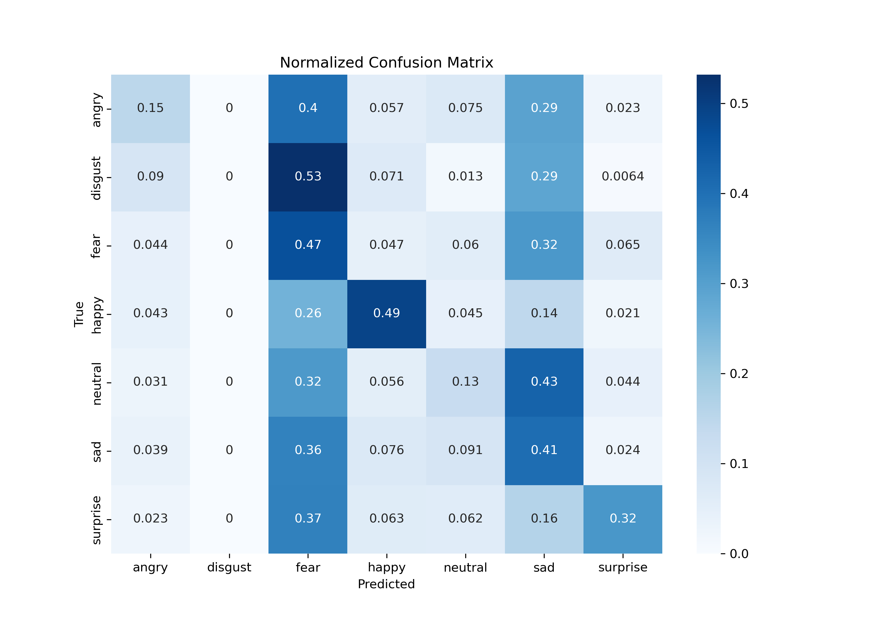

# Facial Emotion Detection with DenseNet

This repository contains the project work for the module Machine Learning for Physicists 2024. The project focuses on implementing a DenseNet architecture for facial emotion detection and comparing its performance with a traditional Convolutional Neural Network (CNN) approach.

## Table of Contents

- [Installation](#installation)
- [Usage](#usage)
- [Files](#files)
- [Report Summary](#report-summary)
- [Acknowledgments](#acknowledgments)

---

## Installation

To set up the environment and run the project, follow these steps:

1. Clone the repository:

    ```bash
    git clone https://github.com/RnLe/MachineLearning.git
    cd MachineLearning
    ```

2. Create and activate the conda environment:

    ```bash
    conda env create -f environment.yml
    conda activate tf_gpu2
    ```

3. Download the dataset from [Google Drive](https://drive.google.com/file/d/1EohQa17A_wiTfE_q6QmBumhSZ0wDhx5_/view?usp=sharing) and extract the `.zip` in the folder `emotions_facial`.

## Usage

To execute the code, you can simply run the `main.ipynb` notebook. This notebook uses the optimal hyperparameters from the `optuna.db` file.

## Files

- `main.ipynb`: Main notebook, using optimal hyperparameters from `optuna.db`.
- `densenet.py`: Implementation of the DenseNet class.
- `alternativeMethod_CNN.ipynb`: Notebook for the alternative method.
- `hyperparam_optimization.py`: Hyperparameter optimization using Optuna.

Note: The optimal hyperparameters are already provided in the project files.

---

## Report Summary

### Abstract & Introduction

Facial expressions serve as strong indicators of human emotion. Consequently, Facial Emotion Recognition (FER) has become increasingly significant for human-machine interaction, with applications ranging from automated mood detection in customer service to security and public safety [1].

This study explores the use of **DenseNet** architectures to address the challenges of FER using the FER2013 dataset [2]. While traditional Convolutional Neural Networks (CNNs) are powerful, they often struggle with feature retention in deeper layers. This project aims to train a DenseNet model to improve feature reuse and mitigate overfitting, comparing its performance against a simpler CNN alternative to quantify the benefits of dense connectivity [3].

### Dataset

The dataset consists of 48x48 pixel grayscale images categorized into 7 classes. The distribution of the images across these classes is as follows:

<div align="center">

<table>
  <tr>
    <th>Angry</th>
    <th>Disgust</th>
    <th>Fear</th>
    <th>Happy</th>
    <th>Neutral</th>
    <th>Sad</th>
    <th>Surprise</th>
    <th>Total</th>
  </tr>
  <tr>
    <td>7532</td>
    <td>815</td>
    <td>7705</td>
    <td>13739</td>
    <td>9490</td>
    <td>9242</td>
    <td>5717</td>
    <td>54240</td>
  </tr>
</table>

</div>

<p align="center">
  
  <br>
  <em>Figure 1: Sample images from the FER2013 dataset representing different emotional expressions.</em>
</p>

### Architecture

The core of this project is the **Densely Connected Convolutional Network (DenseNet)**. Unlike traditional CNNs that connect layers sequentially, DenseNet introduces direct connections between all layers within a dense block. This architecture ensures that each layer receives feature maps from all preceding layers, which promotes feature reuse, improves gradient flow, and mitigates the vanishing gradient problem [4].


*Figure 1: Visualization of a deep DenseNet with three dense blocks and transition layers.*

### Hyperparameter Optimization

To maximize model performance, we employed the **Optuna** framework using the Tree-structured Parzen Estimator method [5]. The optimization process involved 40 steps, evaluating various hyperparameters including the number of dense blocks, growth rate, dropout rates, and L2 regularization factors to balance model complexity and generalization.

---

### Results

The DenseNet architecture demonstrated superior performance compared to the traditional CNN baseline.

- **DenseNet Accuracy:** 57%
- **CNN Accuracy:** 34%

The confusion matrices reveal that while the DenseNet generalizes reasonably well, the traditional CNN struggles significantly with class imbalance, failing completely to predict the "disgust" class and biasing heavily towards representative classes like "angry" [3].

<table>
  <tr>
    <td align="center">
      
      <br>
      <em>Figure 2: Normalized Confusion Matrix for the optimal DenseNet model.</em>
    </td>
    <td align="center">
      
      <br>
      <em>Figure 3: Normalized Confusion Matrix for the alternative CNN model.</em>
    </td>
  </tr>
</table>

### Conclusion

This study demonstrates that DenseNet architectures significantly outperform traditional CNNs in facial emotion recognition by leveraging dense connectivity for improved feature propagation. While accuracy improved, future work must address data quality limitations by integrating temporal data and advanced augmentation techniques

---

## Acknowledgments

This project was completed as part of the Machine Learning for Physicists 2024 module at [TU Dortmund](https://www.tu-dortmund.de/en/).

For any questions or issues, please feel free to contact the authors.

## References

[1] A.-L. Cîrneanu, D. Popescu, and D. Iordache. "New Trends in Emotion Recognition Using Image Analysis by Neural Networks, A Systematic Review". In: *Sensors* 23.16 (2023).

[2] Kaggle. "FER-2013 - Learn facial expressions from an image". Available: [Kaggle Dataset](https://www.kaggle.com/datasets/msambare/fer2013).

[3] R. M. Lehner and L. Hagemann. "Machine Learning for Physicists: Final Report". TU Dortmund, 2024.

[4] G. Huang, Z. Liu, L. van der Maaten, and K. Q. Weinberger. "Densely Connected Convolutional Networks". In: *Proceedings of the IEEE conference on computer vision and pattern recognition* (2017).

[5] T. Akiba, S. Sano, T. Yanase, T. Ohta, and M. Koyama."Optuna: A Next-generation Hyperparameter Optimization Framework". arXiv:1907.10902 (2019).

---

Enjoy exploring the project and feel free to contribute or provide feedback!
